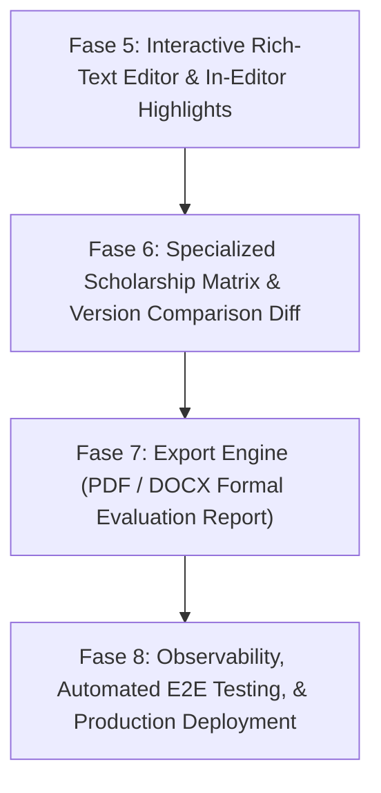

# Roadmap & Panduan Fase Pengembangan Lanjutan EssayMentor AI

Dokumen ini merinci arah pengembangan masa depan, metodologi teknis, arsitektur modul baru, serta aturan baku rekayasa perangkat lunak (*engineering rules*) yang wajib ditaati pada setiap fase.

---

## 📌 Status Pengembangan Saat Ini (Completed)

| Fase | Fokus | Status | Capaian Utama |
|---|---|---|---|
| **Fase 1** | MVP Foundation & AI Engine | ✅ Selesai | Next.js 15, NestJS 11, MySQL 8, Gemini 2.5 Flash + Groq Llama 3.3 Fallback |
| **Fase 2** | Autentikasi & Persistensi | ✅ Selesai | Passport JWT, Register/Login, Dashboard Riwayat Draft, MySQL Prisma |
| **Fase 3** | Real-Time SSE & Aksesibilitas | ✅ Selesai | Server-Sent Events live stream, Style Fingerprint, Theme Dual-Mode WCAG AA |
| **Fase 4** | Audit Keamanan & Arsitektur | ✅ Selesai | Helmet, Strict CORS, Multi-Tier Throttling, class-validator, RBAC, AbortSignal Stream |

---

## 🚀 Fase Pengembangan Lanjutan (Next Phases)



---

## 📝 FASE 5: Interactive Rich-Text Editor & In-Editor Semantic Highlights

### 1. Penjelasan
Saat ini mahasiswa menulis esai di dalam textarea biasa, dan hasil anotasi AI ditampilkan di panel kanan terpisah.
Pada Fase 5, textarea akan digantikan dengan **Interactive Rich-Text Editor** (berbasis **TipTap / ProseMirror**). Kalimat-kalimat yang memiliki anotasi AI (Strength, Suggestion, Critical, Structural, Tone) akan langsung memiliki garis bawah atau *highlight* warna semantik di dalam teks editor itu sendiri. Mahasiswa dapat mengklik kalimat tersebut untuk membuka *popover* saran perbaikan secara kontekstual.

### 2. Teknik Pelaksanaan
- **Frontend Core:**
  - Pasang `@tiptap/react`, `@tiptap/pm`, dan `@tiptap/starter-kit`.
  - Buat kustom extension `AnnotationMark`:
    ```typescript
    // Contoh konsep TipTap Mark Extension
    const AnnotationMark = Mark.create({
      name: 'aiAnnotation',
      addAttributes() {
        return {
          type: { default: 'SUGGESTION' },
          feedbackId: { default: null },
          message: { default: '' },
        };
      },
      renderHTML({ HTMLAttributes }) {
        return ['span', mergeAttributes(HTMLAttributes, { class: `annotation-highlight ${HTMLAttributes.type}` }), 0];
      },
    });
    ```
  - Petakan `sentenceIndex` dari respons AI ke rentang karakter (*character offsets*) di TipTap node tree menggunakan algoritma *sentence boundary detection* (Intl.Segmenter).
  - Tampilkan popover interaktif di atas kalimat terpilih dengan tombol:
    - *Lihat Penjelasan*: Menampilkan alasan evaluasi Dr. Mentor.
    - *Terapkan Saran*: Mengganti kalimat dengan opsi alternatif jika tersedia.
    - *Abaikan*: Menghilangkan highlight anotasi.

### 3. Rulenya (Engineering Rules)
1. **Rule 5.1 (Single Source of Plaintext):** Simpan teks esai di database selalu dalam format teks murni (*raw plain string*), BUKAN format HTML TipTap. Parsing HTML ke plain string wajib dilakukan sebelum payload dikirim ke API backend agar token LLM tidak terbuang untuk tag-tag HTML.
2. **Rule 5.2 (Zero Latency Typing):** Rendering highlight anotasi tidak boleh memperlambat pengetikan (*no typing lag*). Terapkan debouncing minimal 400ms untuk kalkulasi posisi offset DOM.
3. **Rule 5.3 (Non-Destructive Highlighting):** Mahasiswa tetap bebas mengedit, memotong, atau menambah kata tanpa merusak integritas teks di sekitarnya.

---

## 🎯 FASE 6: Specialized Scholarship Matrix & Version Comparison Diff

### 1. Penjelasan
Setiap lembaga beasiswa memiliki rubrik penilaian dan jumlah pertanyaan esai yang berbeda:
- **LPDP RI:** Esai Komitmen Kembali ke Indonesia & Rencana Kontribusi Pasca Studi (1.500 - 2.000 kata).
- **Chevening (UK):** 4 Esai Terpisah: Leadership & Influencing, Networking, Studying in the UK, Career Plan (masing-masing 500 kata).
- **Fulbright (USA):** Personal Statement vs Study Objective.
- **AAS (Australia Awards):** Keterkaitan pembangunan daerah dan kerja sama bilateral.

Fase 6 memperdalam pemahaman domain AI dengan memilih template beasiswa yang otomatis menyesuaikan instruksi sistem, serta menyediakan **Version Diff Visualizer** (perbandingan versi 1 vs versi 2 berdampingan).

### 2. Teknik Pelaksanaan
- **Backend Architecture (Strategy Pattern):**
  - Buat folder `backend/projekai/src/essay/rubrics/` berisi rubrik khusus:
    - `lpdp.rubric.ts`
    - `chevening.rubric.ts`
    - `fulbright.rubric.ts`
    - `aas.rubric.ts`
  - Buat `RubricFactory` yang memilih rubrik secara dinamis berdasarkan parameter `scholarshipTarget`.
- **Frontend Version Diffing:**
  - Gunakan library `diff` atau `diff-match-patch` untuk menghitung perubahan antar draf.
  - Tampilkan split view berdampingan (Draf Lama vs Draf Baru):
    - Teks yang dihapus: Latar merah muda dengan coretan (*strikethrough*).
    - Teks yang ditambahkan: Latar hijau muda tebal.
    - Delta skor visual: Menampilkan kenaikan/penurunan skor per dimensi (misal: Structure +8, Relevance +12).

### 3. Rulenya (Engineering Rules)
1. **Rule 6.1 (Rubric Integrity):** Rubrik spesifik beasiswa tidak boleh bertentangan dengan rubrik inti 5 dimensi (Structure, Tone, Relevance, Originality, Impact). Rubrik khusus hanya mempertajam kriteria skor, bukan menghapus format output JSON yang sudah baku.
2. **Rule 6.2 (Independent Draft Versioning):** Setiap kali mahasiswa menekan tombol evaluasi baru pada draf yang sama, buat record riwayat versi baru di database (`version: currentVersion + 1`), sehingga draf lama tidak pernah tertimpa atau hilang.

---

## 📄 FASE 7: Export Engine (PDF & DOCX Formal Evaluation Report)

### 1. Penjelasan
Mahasiswa sering kali ingin mencetak atau membagikan hasil evaluasi esai mereka kepada dosen pembimbing, mentor kampus, atau menyimpannya secara offline.
Fase 7 menghadirkan fitur **Unduh Laporan Evaluasi Resmi (PDF / DOCX)** yang mencakup metadata mahasiswa, teks esai lengkap, skor radar chart, catatan kekuatan utama, dan daftar rekomendasi perbaikan.

### 2. Teknik Pelaksanaan
- **Opsi A: Backend Generation (Rekomendasi untuk Konsistensi):**
  - Gunakan `pdfkit` atau `@react-pdf/renderer` di sisi server.
  - Buat endpoint `GET /essay/:id/export/pdf` dan `GET /essay/:id/export/docx`.
  - Stream buffer PDF langsung ke klien dengan header:
    - `Content-Type: application/pdf`
    - `Content-Disposition: attachment; filename="EssayMentor_Report_[Title].pdf"`
- **Opsi B: Word Generation (DOCX):**
  - Gunakan library `docx` (npm) untuk menyusun dokumen Microsoft Word terformat rapi dengan tabel skor dan daftar poin saran.

### 3. Rulenya (Engineering Rules)
1. **Rule 7.1 (Watermarking & Timestamp):** Setiap dokumen yang diekspor wajib memuat tanggal evaluasi, model AI yang digunakan, skor komposit, serta disclaimer bahwa evaluasi bersifat bimbingan (*mentorship aid*).
2. **Rule 7.2 (Memory & Stream Protection):** Pembuatan file PDF/DOCX harus di-stream atau dibersihkan dari RAM setelah dikirimkan, tidak boleh meninggalkan file sampah (*temporary files*) di disk server.
3. **Rule 7.3 (Strict Authorization):** Endpoint export wajib melalui verifikasi kepemilikan draf yang sama seperti `GET /essay/:id` (IDOR safe).

---

## 📊 FASE 8: Observability, Automated E2E Testing, & Production Deployment

### 1. Penjelasan
Menyiapkan sistem menuju kesiapan skala produksi (*production readiness*) dengan pengujian otomatis menyeluruh, pemantauan error, dan orkestrasi deployment otomatis.

### 2. Teknik Pelaksanaan
- **Automated Testing Suite:**
  - **Unit Testing (Jest):** Menjangkau `auth.service.spec.ts`, `essay.service.spec.ts`, dan validasi DTO.
  - **End-to-End Testing (Playwright):** Uji alur nyata mahasiswa mulai dari registrasi akun, login, membuka evaluator, mengetik esai, memulai evaluasi live stream, hingga melihat grafik skor.
- **Observability & Error Tracking:**
  - Integrasikan **Sentry** untuk error tracking di frontend (Next.js) dan backend (NestJS).
  - Tambahkan middleware telemetry untuk mencatat latensi per panggilan AI provider (Gemini vs Groq) dan failure rate fallback.
- **Docker Containerization & CI/CD:**
  - Optimalkan `backend/projekai/Dockerfile` (multi-stage build Node.js Alpine).
  - Optimalkan `frontend/projekai/Dockerfile` (multi-stage build Bun/Next.js standalone).
  - Konfigurasi GitHub Actions (`.github/workflows/ci.yml`) untuk menjalankan lint, type-check, dan build pada setiap push ke branch `main`.

### 3. Rulenya (Engineering Rules)
1. **Rule 8.1 (Zero Test Flakiness):** Uji E2E tidak boleh memanggil API Gemini/Groq asli menggunakan token berbayar. Gunakan *mock network responses* atau mock server untuk pengujian otomatis di pipeline CI.
2. **Rule 8.2 (No Sensitive Secrets in CI):** Semua API key dan rahasia database wajib disimpan di GitHub Repository Secrets, tidak boleh ada hardcoded string di file `.yml`.

---

## 🛡 Golden Engineering Rules (Aturan Utama Rekayasa)

Seluruh pengembang, kontributor, dan agen AI yang bekerja pada proyek EssayMentor AI **wajib mematuhi 5 aturan mutlak berikut:**

### 1. Rule 1: Zero AI Voice Override (Preservasi Personal Voice)
- AI adalah mentor, bukan joki esai.
- Dilarang keras membuat fitur yang secara otomatis menulis ulang keseluruhan esai mahasiswa menjadi kalimat baru.
- AI hanya boleh memberikan kritik, skor, dan alternatif kalimat sebagai bahan belajar mahasiswa.

### 2. Rule 2: Anti-Slop UI & Accessibility (WCAG AA & Copy Cleanliness)
- Setiap komponen UI wajib mendukung mode terang (*Light Mode*) dan gelap (*Dark Mode*) dengan rasio kontras teks minimal **4.5:1** (WCAG AA).
- Dilarang menggunakan karakter em dash pada salinan teks UI atau komentar kode. Gunakan titik dua (`:`), tanda koma (`,`), tanda hubung spasi (` - `), atau tanda kurung.
- Desain antarmuka harus terasa fungsional, bersih, dan dibuat dengan presisi tipografi akademis.

### 3. Rule 3: Secure by Default (Keamanan Tanpa Kompromi)
- Semua request masuk wajib divalidasi dengan `class-validator` melalui pipa global `{ whitelist: true, forbidNonWhitelisted: true }`.
- Lindungi setiap endpoint baru dari serangan brute-force atau scraping menggunakan `@Throttle`.
- Cegah broken object-level authorization (IDOR) dengan selalu memverifikasi `userId` dari JWT token terhadap kepemilikan objek di database.
- Data analitik platform (pemakaian token dan biaya operasional) wajib dilindungi oleh `Role.ADMIN`.

### 4. Rule 4: Resilient Streaming & Token Safety
- Semua request streaming AI ke klien wajib dipasangi `AbortController`. Jika klien memutuskan sambungan, inferensi model wajib segera dihentikan.
- Batas atas panjang input esai wajib terkunci di DTO (maksimal 25.000 karakter) untuk mencegah pembengkakan biaya API (*Denial of Wallet*).
- Setiap evaluasi streaming wajib mencatat estimasi pemakaian token ke database untuk audit transparansi.

### 5. Rule 5: NodeNext ESM Strictness (TypeScript Backend)
- Backend menggunakan modul NodeNext ESM.
- Setiap import modul internal di dalam direktori `backend/projekai/src/` **wajib menyertakan ekstensi `.js` secara eksplisit** (contoh: `import { EssayService } from './essay.service.js';`).
- Jangan menghapus atau menghilangkan ekstensi `.js` saat melakukan refactoring.

---

## 📋 Checklist Eksekusi Fase Berikutnya (Prioritas Implementasi)

Saat Anda siap memulai fase berikutnya, ikuti urutan prioritas ini:

- [ ] **Fase 5 (Rich-Text Editor TipTap):**
  - [ ] Install library TipTap pada frontend (`bun add @tiptap/react @tiptap/pm @tiptap/starter-kit`).
  - [ ] Buat komponen `EssayEditor.tsx` pengganti textarea.
  - [ ] Hubungkan highlight warna kalimat dengan event streaming SSE.
- [ ] **Fase 6 (Rubrik Khusus & Diff):**
  - [ ] Susun berkas rubrik LPDP dan Chevening di backend.
  - [ ] Buat komponen visual perbandingan versi di halaman Evaluator.
- [ ] **Fase 7 (Export PDF/Word):**
  - [ ] Buat service generator PDF terformat di backend.
  - [ ] Tambahkan tombol "Unduh Laporan Evaluasi" di panel skor.
- [ ] **Fase 8 (CI/CD & E2E):**
  - [ ] Buat suite Playwright test untuk flow utama.
  - [ ] Uji coba deployment container Docker ke server staging/cloud.
